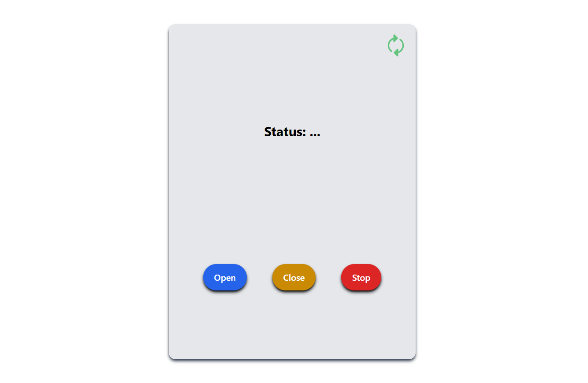

# Automatic Gate with MQTT

Esse projeto é a implementação de uma interface gráfica que se comunica via MQTT para controlar um portão.

### Controlador


## Tecnologias utilizadas
- Python, Flask e MQTT para o backend
- HTML, CSS, Tailwind CSS, Jinja2 e Java Script para o frontend

## Pré-requisitos

- [Python 3.12.1](https://www.python.org/downloads/release/python-3121/) ou superior

## Instalação
Faça o clone do repositório:

```bash
git clone https://github.com/ArthurBuenoSilva/C115-Trabalho-1-Chatbot.git
```

Acesse a pasta onde você clonou o repositório:

```bash
cd caminho/para/o/projeto
```

Crie um ambiente virtual(venv):

```bash
python -m venv venv
```

Acesse o ambiente virtual criado:

```bash
venv/Scripts/activate
```

Instale as dependências necessárias:
```bash
pip install -r requirements.txt
```

## Uso
Agora execute o script main.py:

```bash
python main.py
```

No terminal deve aparecer uma mensagem parecida com essa:

```bash
 * Serving Flask app 'app'
 * Debug mode: off
WARNING: This is a development server. Do not use it in a production deployment. Use a production WSGI server instead.
 * Running on http://127.0.0.1:49675
Press CTRL+C to quit
```

Agora que o servidor já está em execução, abra o navegador e acesse a URL exibida no terminal.

No meu caso, a URL seria http://127.0.0.1:49675.

No navegador, você poderá interagir com o chatbot e visualizar o histórico de mensagens.


## Contribuições

Solicitações de pull requests são bem-vindas. Para mudanças importantes, abra uma issue primeiro para discutir o que você gostaria de mudar.